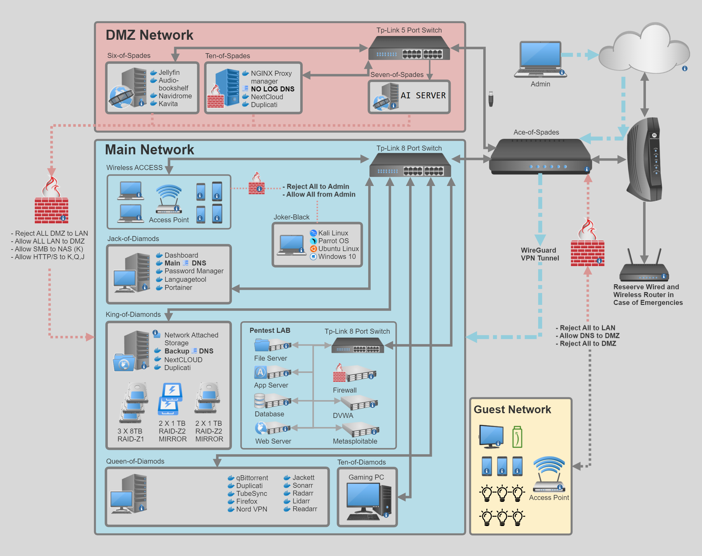

# House of Cards

I would like to take a moment and thank people that played very important role in my learning process (SEE Teachers Section). Their informative and engaging videos, articles and classes have simplified complex topics, making them accessible and enjoyable for me to grasp. Their dedication to sharing knowledge has had a profound impact on my growth, and I am truly thankful for their valuable contributions. I encourage you to subscribe and contribut to their work. Best regards to all of you. 

## Home Lab

This repository contains the configuration files and documentation for my home lab, which is a network environment consisting of multiple servers and Docker containers. The purpose of this lab is to provide a platform for learning, experimentation, and testing of various networking and security technologies.

### Network MAP

### Equipment and Open Source Software Used

| Name On the Network                                         | Description        |
| -------------------------------------------------------------------------- | ---------------------------------- |
| [Ace-of-Spades](/hardware-and-software/mini-pc/Ace-of-Spades.md)           | Main Router and Firewall           |
| [Ten-of-Spades](/hardware-and-software/mini-pc/Ten-of-Spades.md)           | Reverse Proxy Server in DMZ        |
| [Seven-of-Spades](/hardware-and-software/laptop-and-pc/Seven-of-Spades.md) | Powerful server for Jellyfin       |
| [Six-of-Spades](/hardware-and-software/mini-pc/Six-of-Spades.md)           | Server of different types of media | 
	
| Name On the Network                                           | Description          |
| ---------------------------------------------------------------------------- | --------------------------------- |
| [King-of-Diamods](/hardware-and-software/laptop-and-pc/King-of-Diamods.md)   | Network Attached Storage Server   |
| [Queen-of-Diamonds](/hardware-and-software/mini-pc/Queen-of-Diamonds.md)     | Media Processing Server           |
| [Jack-of-Diamonds](/hardware-and-software/laptop-and-pc/Jack-of-Diamonds.md) | Main DNS, Password Manager Server |
| [Ten-of-Diamonds](/hardware-and-software/laptop-and-pc/Ten-of-Diamonds.md)   | Gaming , Work PC                  | 

| Name On the Network                                 | Description |
| ------------------------------------------------------------------ | ------------------------ |
| [Joker-Black](/hardware-and-software/laptop-and-pc/Joker-Black.md) | Main Admin Laptop        | 

-----

### Future Learning and Roadmap

Here are my future learning plans and a simple roadmap to guide my progress and skill development in different technologies and practices.

1.  **Deploy Proxmox**: To optimize resource usage and scalability by managing virtual machines and containers in each of the servers.
4.  **Deploy Honeypots**: Deploying honeypots will provide valuable insights into threats and enhances lab security.
2.  **Learn Terraform**: To automate infrastructure configuration, ensuring consistent and reproducible resource provisioning in my lab.
3.  **Learn Ansible**: To simplify system and application management in my lab by automating tasks and maintaining consistent configurations.
5.  **Learn Kubernetes**: To facilitate easy scaling and orchestration of containerized applications in the lab.

-----

### Awesome Resources and Tools

| Tool                                  | Description           |
| ----------------------------------------------------- | ------------------------------------- |
| [Tabby](https://github.com/Eugeny/tabby)              | Highly configurable terminal emulator |
| [Ventoy](https://www.ventoy.net/en/index.html)        | Easy Multiboot USB Creator            |
| [Obsidian](https://obsidian.md/)                      | One of the best note-taking tools     |
| [Lightshot](https://app.prntscr.com/en/download.html) | Convenient Screenshot taking tool     |

 [Tabby Tutorial](https://www.youtube.com/watch?v=-yfuYPowUDE)  
 [Ventoy Tutorial](https://www.youtube.com/watch?v=-hs4mH7uBkk)   
 [Obsidian Tutorial Playlist](https://www.youtube.com/playlist?list=PL5fd4SsfvECy0zzf8Cyo20ZoipEt6YeL3)

### Teachers 

 [Awesome Open Source](https://www.youtube.com/@AwesomeOpenSource/featured)  [Lawrence Systems](https://www.youtube.com/@LAWRENCESYSTEMS)  [DB Tech](https://www.youtube.com/@DBTechYT)  [Raid Owl](https://www.youtube.com/@RaidOwl)  [Ben Eater](https://www.youtube.com/@BenEater)  [IBRACORP](https://www.youtube.com/@IBRACORP)  [Techno Tim](https://www.youtube.com/@TechnoTim)  [Mark Furneaux](https://www.youtube.com/@TheUbuntuGuy)  [Christian Lempa](https://www.youtube.com/@christianlempa)  [John Hammond](https://www.youtube.com/@_JohnHammond)

 [Чёрный Треугольник](https://www.youtube.com/@Black_Triangle)  [DesignerMix](https://www.youtube.com/@DesignerMix)  [Нетипичный Безопасник](https://www.youtube.com/@MChannelone)  

 [Sevada Isayan](https://www.linkedin.com/in/sevadaisayan/)  [Gevorg Atoyan](https://www.linkedin.com/in/gevorgatoyan/)   
  
 [Tumo Center Of Creative Technologies](https://tumo.org/)   

##### Disclaimer
This home lab is intended strictly for educational and experimental purposes. Any use of information provided in this lab for illegal or unethical activities is strictly prohibited. The creator cannot be held responsible for any consequences resulting from misuse. By accessing and using information provided in this lab, you acknowledge and agree to comply with all applicable laws and ethical guidelines. Use this information responsibly and at your own risk.

